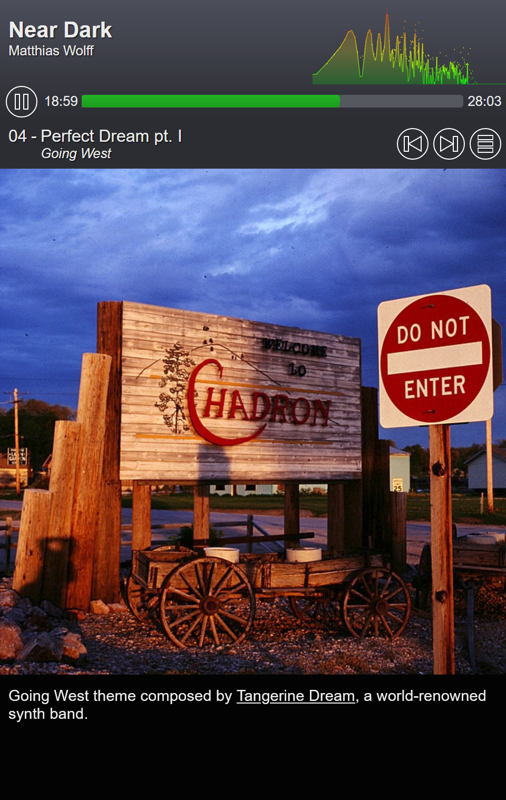

# MusicBookPlayer.js
DHTML audio player displaying booklet pages for audio tracks

[1&emsp;Introduction](#intruduction)<br>
[2&emsp;Create Your Own Music Book](#cyomb)<br>
&emsp;&ensp;[2.1&emsp;Prerequisites](#prerequisites)<br>
&emsp;&ensp;[2.2&emsp;Setup](#setup)<br>
[3&emsp;API Documentation](#apidoc)

<a id="intruduction"></a>
## 1&emsp;Introduction
A music book is playlist of audio files (also called _tracks_) including a HTML/Javascript-based player. A music book consists of one or several _pages_ per audio file. Each page displays an image and, optionally, a description text. If there are several pages for one audio file, we will call the respective audio segments _parts_. Each part is defined by an offset in its audio file. The structure of a music book is as follows:
1. Cover page (1x)
2. Audio track or part pages (Nx)
3. Table of contents (1x, created automatically)

`MusicBookPlayer.js` features audio controls (play/pause, time rail), play list contols (next, previous, contents), and a [live audio spectrum analyzer](https://audiomotion.dev/#/). In a browser, a music book will be displayed like this (click on images to enlarge):

| Cover page example | Part page example | Contents page example | 
| :---: |  :---: |  :---: | 
|  |  |  |

<a id="cyomb"></a>
## 2&emsp;Create Your Own Music Book
The `MusicBookPlayer.js` library is to allow you creating your own music books. It is optimized for smartphones but it will work on tables and desktop devices as well.

<a id="prerequisites"></a>
### 2.1&emsp;Prerequisites
To host your own music books, you need the following
1. a webserver
2. a bunch of audio files, preferably in the MP3 format<sup>1)</sup>
3. a cover image<sup>2)</sup>
4. a images for each page of the book<sup>2)</sup>
5. optionally, a description text of the book and for each page of the book<sup>3)</sup>

<sup>1)</sup> preferably in the MP3 format<br>
<sup>2)</sup> peferably square, e.g. 600 x 600 px, and in the JPEG format<br>
<sup>3)</sup> description texts may contain HTML markup

<a id="setup"></a>
### 2.2&emsp;Setup

```html
<video autoplay controls class="player" id="player1" height="360"
	width="100%" loop muted poster="/path/to/poster.jpg"
	preload="none" src="/path/to/media.mp4"
	style="max-width: 100%" tabindex="0" title="MediaElement">
</video>
```
<a id="apidoc"></a>
## API Documentation
